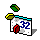

<h1 align="center">Hi 👋, I'm Paul Sáenz Sucre.</h1>
<h3 align="center">A passionate full stack and desktop developer from Perú.</h3>

  

  More about me
  

  

  I am a full-stack web developer and a self-taught desktop developer. Currently, I am in the process of refactoring my old desktop application. The application enables users to sell food in a restaurant through a web interface. I utilize standard languages such as HTML5, CSS3, and JavaScript, along with React and Redux libraries for the front-end. For the backend, I employ Ruby on Rails and PostgreSQL.
  

  

  I have had a passion for computers since my childhood. My father introduced me to coding using a programming language called BASIC. As I grew older, I took it upon myself to learn Assembly language and develop an application called DSKPATCH, which served as a hard disk sector data editor. During this time, I dedicated additional hours after school to teach myself various programming languages, such as Visual Basic 6, Standard Query Language (SQL), PASCAL, JAVA, and C#, as well as object-oriented programming and other programming paradigms.
  

  

  This extensive experience has equipped me with the ability to design logically coherent algorithms, data structures, and application prototypes during the initial stages of the development process.
  

  

    I am interested in
  

    <ul>
      <li>
        :books: I love to read, especially about programming, electronics, embedded devices, design, mathematics, and chess.
      </li>
      <li>
        :trophy: Playing chess brings me great joy.
      </li>
      <li>
        :guitar: In addition, I enjoy playing music. I have taught myself how to play the guitar and bass, and I am currently learning to play the keyboard.
      </li>
      <li>
        :wrench: Furthermore, I have a passion for crafting circuits with Arduino.
      </li>
    </ul>

<h3 align="left">Connect with me:</h3>

  
  
  
  
  
  
  
  
  
  

<h3 align="left">Skills:</h3>
<h4 align="left">Front-end</h4>

  
  
  
  
  
  
  

<h4 align="left">Backend</h4>

  
  
  
  
  
  

<h4 align="left">Database</h4>

  
  
  
  
  
  

<h4 align="left">Desktop</h4>

  
  
  
  

<h4 align="left">Tools</h4>

  
  
  
  
  

<h4 align="left">Misc</h4>

  
   
  

  

    <h3>Stats</h3>
  

  

    
    
    
    
  

